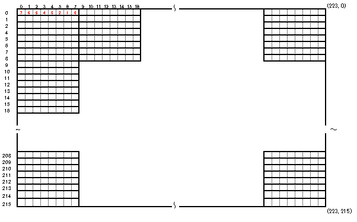

# Arduino STM32 NTSCビデオ出力ラブラリ
##概要
Arduino STM32環境にて利用可能なNTSCビデオ出力ライブラリドライバライブラリです.  
STM32F103x系マイコン搭載ボードにてNTSCビデオ出力を行うことが出来ます.  

**(注意)**  
本ライブラリには描画処理を行うAPI関数は含まれていません。  
描画処理を行うには別途上位のライブラリが必要となります。  

  

##ライブラリ名称
TNTSC (ヘッダーファイル TNTSC.h)  

##仕様
- NTSCモノクロ2色(白・黒)表示
- 表示解像度 横224ドット×縦216ドット グラフィック表示
- ビデオ出力には下記リソースを利用します.
  ・SRAM ビデオ表示用フレームバッファ 6048バイト  
  ・タイマー Timer2  
  ・SPI1  
  ・DMA1 CH3  

##回路図  
  
接続端子  
PA1: 同期信号  
PA7: 映像信号  

##必要部品
- STM32F103xマイコンボード Blue Pill(STMF103C8T6搭載)
- 560Ω 抵抗
- 240Ω 抵抗
- RCAジャック端子(NTSC対応モニターに接続)

##インストール
TNTSCフォルダを各自のArduino STM32インストール先のライブラリ用フォルダに配置する.  
=> インストールフォルダ\hardware\Arduino_STM32\STM32F1\libraries\  
に配置.

##サンプルスケッチの実行
###サンプルスケッチ：MisakiFontOur  
別途下記のライブラリのインストールが必要  
- Arduino-misakiUTF16
(Arduino用 美咲フォントライブラリ 教育漢字・内部フラッシュメモリ乗せ版)  
 https://github.com/Tamakichi/Arduino-misakiUTF16  
 
 **実行結果**  
   

## ライブラリリファレンス
ライブラリはクラスライブラリとして実装しています.  
NTSCビデオ出力の操作はグローバルオブジェクト変数TNTSCを利用します。

###ヘッダーファイル
`#include <TNTSC.h>`

###グローバルオブジェクト
`TNTSC`

###パブリックメンバー変数
| メンバー変数名 | 型 |値|意味
|-----|----|--|---|
|width|uint16_t|224|画面横ドット数
|height|uint16_t|216|画面縦ドット数
|vram_size|uint16_t|6048|フレームバッファサイズ(バイト)

###メンバー関数
####NTSCビデオ出力開始
- 書式
 `void begin()`  

- 引数
 なし  

- 戻り値
 なし

- 説明
 NTSCビデオ出力を開始します.  
 
####NTSCビデオ出力終了
- 書式
 `void end()`  

- 引数
 なし  

- 戻り値
 なし

- 説明
 NTSCビデオ出力を終了します.  
 フレームバッファに格納されているデータを画面に表示します.  
 
####NTSCビデオ出力用フレームバッファ先頭アドレス取得
- 書式
 `uint8_t* VRAM()`  

- 引数
 なし  

- 戻り値
 フレームバッファ先頭アドレス  

- 説明
 NTSCビデオ出力用フレームバッファ先頭アドレスを取得します.
 フレームバッファのバイトデータ内の1ビットは画面上の1ドットに対応しています.  
 1バイト内のビット並びは上位が左、下位が右となります.  
 
 
 取得したフレームバッファアドレスを利用してフレームバッファに直接データを  
 書き込むことで任意の表示を行うことが出来ます.  
 
####画面クリア
- 書式
 `void cls()`  

- 引数
 なし  

- 戻り値
 なし  

- 説明
 フレームバッファを初期化し、画面表示をクリアします.  
 
####フレーム表示待ち
- 書式
 `void delay_frame(uint16_t x)`  

- 引数
 uint16_t x : 表示待ち枚数    

- 戻り値
 なし  

- 説明
 指定したフレーム数の画面が表示されるまで時間待ちを行います.
 画面の表示内容を高速に更新する場合、最低1フレーム分の表示待ちを行うことで  
 チラつきにない更新を行うことが出来ます.  
 1フレームは約1/60秒(16.7ミリ秒)に相当します.  

